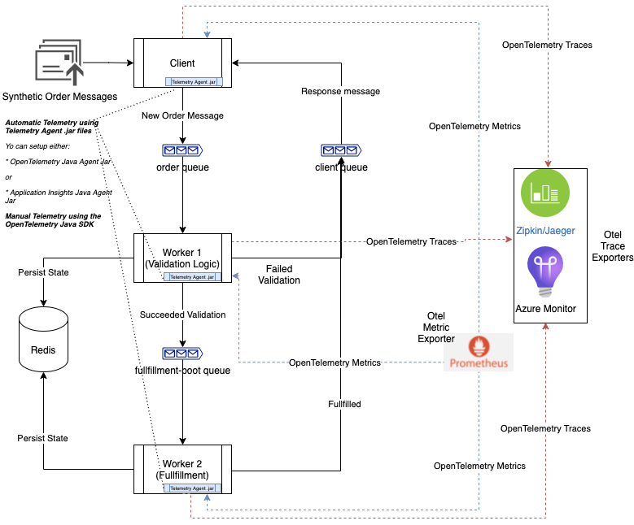
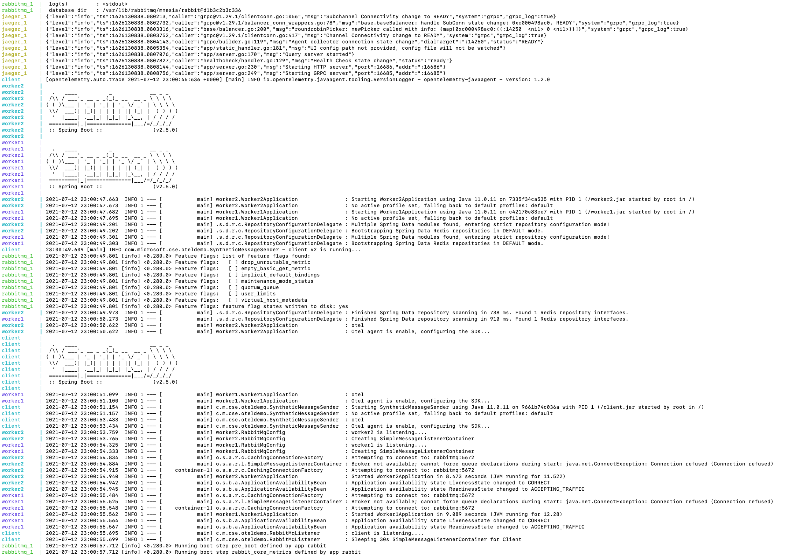
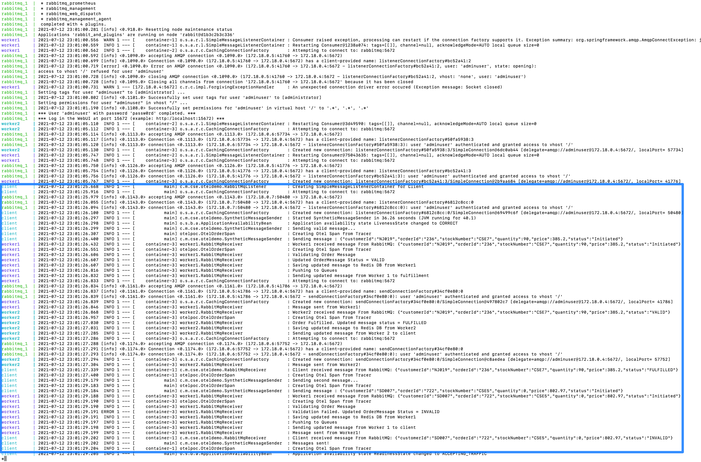
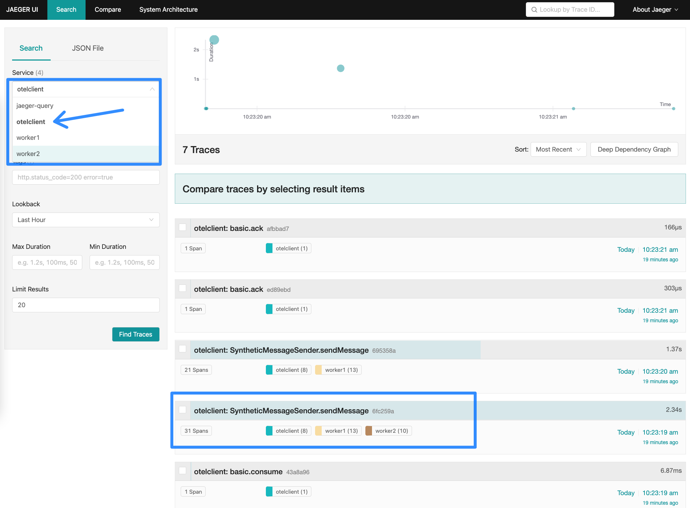
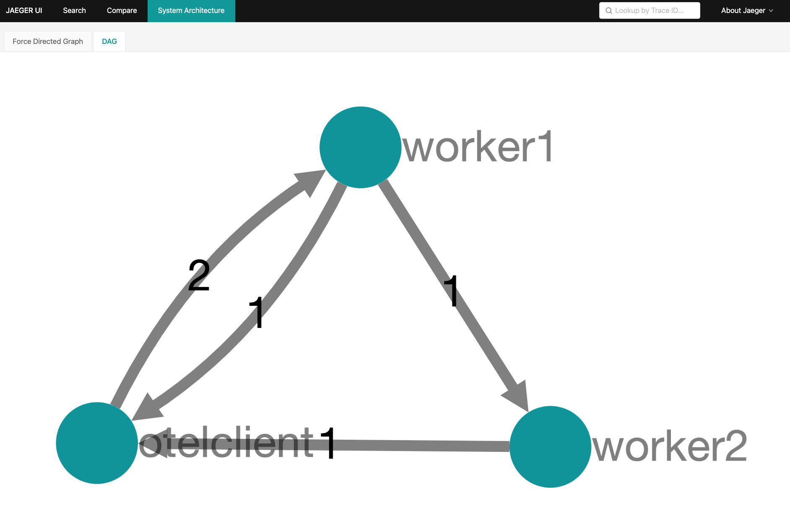
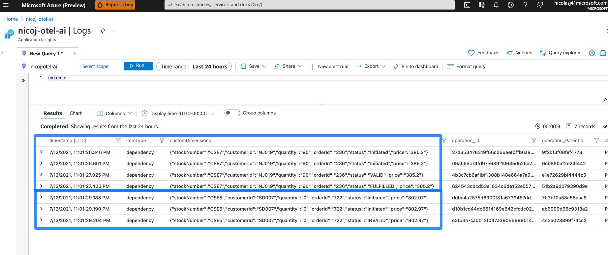
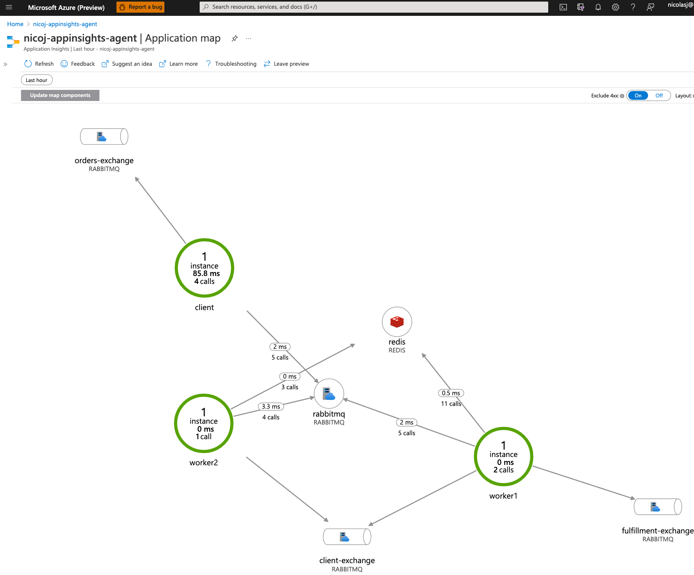

# OpenTelemetry Java POC

## Table of contents

* [TL;DR](#high-level-architecture) <br/>
* [Why is this interisting?](#why-is-this-interesting) <br>
* [High level Architecture](#high-level-architecture) <br/>
  * [Business Flow](#business-flow) <br/>
  * [Repo Structure](#repo-structure) <br/>
  * [Overall PoC Design](#overall-design-of-poc) <br/>
  * [Open Telemetry basic concepts](#open-telemetry-basic-concepts) <br/>
  * [Order Message JSON Example](#order-message-json-example) <br/>
  * [Tools and Frameworks](#tools-and-frameworks) <br/>
* [How to use it](#how-to-use-it) <br>
  * [Environment Prerequisites](#environment-prerequisites) <br/>
  * [Settings](#settings) <br/>
    * [Java OpenTelemetry Agent Mode](#java-opentelemetry-agent-mode) <br/>
    * [Application Insights Agent Mode](#application-insights-agent-mode) <br/>
  * [Build](#build) <br/>
  * [Run](#run) <br/>
  * [Verify the Results](#verify-the-results) <br/>
    * [Jaeger](#jaeger) <br/>
    * [Prometheus](#prometheus) <br/>
    * [App Insights](#app-insights) <br/>
* [OpenTelemetry for Java](#opentelemetry-for-java) <br>
  * [Implementation Patterns](#implementation-patterns) <br>
    * [Automatic Instrumentation](#automatic-instrumentation) <br/>
    * [Manual Instrumentation](#manual-instrumentation) <br/>
    * [Hybrid Instrumentation](#hybrid-instrumentation) <br/>
  * [Integration Options with Azure Monitor](#integration-options-with-azure-monitor)<br>
    * [Using the Azure Monitor OpenTelemetry Exporter Java Library](#using-the-azure-monitor-opentelemetry-exporter-java-library) <br/>
    * [Using the Application Insights Java Agent Jar file](#using-the-application-insights-java-agent-jar-file) <br/>
    * [OtelTelemetry vs Application Insights agents compared](#oteltelemetry-vs-application-insights-agents-compared) <br/>
  * [Known issues](#known-issues) <br>

* [Summary](#summary) <br/>

* [Advanced topics](#advanced-topics) <br>
* [References](#references) <br>

## TL;DR
OpenTelemetry is an open-source, vendor-agnostic, with a single distribution of libraries to provide metrics collection and distributed tracing for services over various technologies and communication protocols. The main goal of this repo is to demonstrate the current state of the Java OpenTelemetry stack and the different alternatives to plug Azure Monitor into one of the possible telemetry exporters. Moreover, the sample Java solution implements an asynchronous distributed messaging (publish/subscribe) architecture where a full business flow overlaps messages traveling and being processed at different stages by different applications, as is the case in many core banking scenarios. 

# Why is this interesting?
1. Building observable systems enable one to measure how well the application is behaving. Adopting open-source standards related to implementing telemetry and tracing features built on top of the OpenTelemetry framework helps decouple vendor-specific implementations while maintaining an extensible, standard and portable open-source solution.
1. Built on top of an end-to-end asynchronous workflow, this PoC allows you to get a real taste of how to instrument a message-oriented architecture through a series of correlated operations in a distributed system using the latest version of the OpenTelemetry Java SDK and OpenTelemetry Java Agent Jar as of July 2021.
1. Validating the promise of the OpenTelemetry stack to allow for "plug and play" components and having a standard, flexible and extensible architecture in every segment of the telemetry lifecycle, by integrating it to **Jarger, Prometheous and Azure Monitor** as telemetry backends. 
1. Drills down into two different approaches to achieve the Azure Monitor integration:
    * Full OpenTelemetry stack, integrating the OpenTelemetry Java SDK, the OpenTelemetry Java Agent Jar, and Azure through the Azure Monitor OpenTelemetry Exporter Java library.
    * An azure-oriented approach using the Application Insights Java Agent jar alongside the OpenTelemetry Java SDK to instrument the code manually.
1. Understanding the difference between the Full OpenTelemetry stack vs. the Azure-oriented approach mentioned above will give you better information for considering one option vs. the other based on your specific use cases. 
1. You will learn the difference between how to implement manual vs. automatic vs. hybrid instrumentation in Java and what you'd get from each of the alternatives. This applies for both **Metrics** and **Traces**

# High-level Architecture 
The primary solution consists of 3 Java Applications, `Client`, `Worker 1`, and `Worker 2` that use a pub/sub pattern to send and receive AMPQ messages among them as the primary communication mechanism. The messaging infrastructure uses a `RabbitMQ` server with three different queues named `Client`, `Orders`, and `Fulfillment`. The solution also uses a `RedisDB` as a simple event sourcing data storage, where every update made to an order is inserted as a distinct record.

## Business Flow
The overall business flow of the solution begins when the Client application creates an `OrderMessage` object that simulates the information needed to fulfill an order request, including the CustomerId, OrderId, StockNumber, Price, and Quantity. The Client Application pushes the message into the `Orders` queue, to which the `Worker1` is subscribed. Once the `Worker1` application pulls a message from the `Orders` queue, it performs a basic business validation making sure that the product of the Price and Quantity is greater than 0. If the validation fails, the `Worker1` will set the status of the `OrderMessage` as failed, store a new record on the Redis DB, and push a response message into the `client` queue. Otherwise, it will set the order status as succeeded, store a new record on the Redis DB, and send a fulfillment message into the `fulfillment` queue, to which the `Worker2` is subscribed.  Once the `Worker2` application pulls a message from the `fulfillment` queue, it will set the status of the `OrderMessage` as fulfilled, store new record on the Redis DB, and push a response message into the `client` queue. Finally, the `Client` application will pull messages coming from the `client` queue, finalizing the whole lifecycle of the solution.

## Repo Structure

There are 7 Modules in our OpenTelemetry POC that maps to its correspondent folders and service that can be found in the `docker-compose.yml`:

* `RabbitMQ and the Infrastructure folder` - Stands up underlying RabbitMQ queues named Client, Orders, and Fulfillment.

* `Redis DB` - An open source key value store that is used for its in-memory data structure store capabilities.

* `Java Workers-Core` - Java library used by the other applications that provides *OrderMessage* JSON Object Class for Workers, and OpenTelemetry configuration and a Span factory for *OrderMessage* attributes.

* `Java Worker 1` - Validation Woker: Subscribes for messages coming off the *Orders queue*. The Module validates *OrderMessage* JSON Schema, does simple validation of values & updates status field. If validation succeeds, a response message is then pushed to the *Fulfillment queue*. Otherwise a failed response is pushed to *Client queue*. Either way, the state of the order is updated in the Redis database.

* `Java Worker 2` - Fulfilment Worker: Subscribes for messages coming off *Fullfilment queue*. Fulfills order (dummy fullfillment) & updates status field and sends the response back to the client by pushing the message to *Client queue*. State is updated in the Redis database.

* `Java Client` - Tests system by creating synthetic *OrderMessage*  messages and initiating the process by sending messages to the *Orders queue* and waits for responses on the *client queue*

* `Jaeger` - An open source tracing telemetry backend.

* `Prometheus` - An open source monitoring and alerting toolkit system

Additionally the `agents' folder` - contains the java agent .jar files used to instrument the java applications using the -javaagent option automatically. See how to configure the environment **below** to choose between the OpenTelemetry or the Applications Insights Java agents.

## Overall Design of POC



## Open Telemetry basic concepts

A detailed explanation of OpenTelemetry concepts is out of the scope of this repo. There is plenty of available information about how the SDK and the Java Agent are configured and how the Exporters, Tracers, Context, and Span's hierarchy works. See the Reference section for useful OpenTelemetry resources.

However, understanding the core implementation patterns will help you better use your time when running this solution. These are three main patterns as follows:

* Automatic telemetry: In Java, OpenTelemetry automated instrumentation (100% codeless) is implementing by running the OpenTelemetry Java Agent Jar file. When running the Java command to run the application, make sure to use the -javaagent option pointing to the location where the `.jar` file is located. The agent reads a set of predefined environment variables used to configure its behavior and various exporter settings. The agent will also run as a "sidecar" attached to the main Java application, intercepting all interactions and dependencies and automatically sending the telemetry to the configured exporters. There is more information on the specific technical details in the sections below in this guide.

* Manual tracing: This must be done by actually coding using the OpenTelemetry Java SDK, managing the `tracer` objects to obtain Spans, and forming instrumented OpenTelemetry Scopes to identify the code segments be traced manually.  Also, by using the @WithSpan annotations. There is more information on the specific technical details in the sections below in this guide.

* Hybrid approach: Most Production-ready scenarios will require a mix of both techniques, using the OpenTelemetry Java Agent to collect automatic telemetry and the OpenTelemetry SDK to identify code segments that are important to instrument manually. This solution uses this approach.


## Order Message JSON Example

``` json
{
   "customerId":"id",
   "orderId":"1234",
   "stockNumber":"4346",
   "quantity":4,
   "price":4.5,
   "status":"Validation Successful"
}
```
## Tools and Frameworks
The following are the set of technologies and tools used to implement the complete architecture.
* The messaging middleware is implemented with a **RabbitMQ** server, packaged on an independent container defined in the Dockerfile within the `./infraestructure/rabbitmq` folder. Additional critical artifacts within that rabbitmq folder will create the admin user and give it the specific needed permissions. The provisioning of all the Queues, Exchanges, and Bindings are declared on the `definitions.json` 
* All applications are implemented using **Java SpringBoot**
  * Each application folder has a `Dockerfile` definition. Especially useful for, among other things, define the `ENTRYPOINT` with the `-javaagent` option
  * Each application folder has a `Makefile`, that helps automate the management of the `tmp` folder and copying the right Java Agent Jar (see more information in the detailed sections below)
  * The `RabbitMqListener` and `RabbitMqReceiver` Java Classes, within each application, use the `org.springframework.amqp.rabbit.listener.SimpleMessageListenerContainer` and `org.springframework.amqp.rabbit.listener.adapter.MessageListenerAdapter` imports for connecting and subscribing to its respective queues.
* As mentioned in the Repo Structure section above, the solution uses a master `docker-compose.yaml` file that orchestrates all services and simplifies running the solution from a single command. Check the **How to use it** section for more details
* `Redis DB` - An open-source key-value store used for its in-memory data structure store capabilities is defined on the docker-compose file, runs on its own independent Redis Image, and is consumed using the default settings. The `OrderMessageRepository` class within the workers-core utility library manages the main interaction with Redis, using the `org.springframework.data.repository.CrudRepository` import.
* Finally, a master Makefile that orchestrates running a `docker-compose down`, executing a `maven clean` and `package`, and building the images for all containers in the solution. Check the **How to use it** section for more details

# How to use it?

## Environment Prerequisites
1. Install Make (Already available in MacOS and most Linux dist.)
2. Install and run the Docker engine
3. Install the Maven CLI

## Settings
Make sure you are located on the **otelpoc** directory.

Edit the ./.env file to define the agent mode to run either the **otel** or **applicationinsights** agent:

`AGENTTYPE=otel or appinsights`

### Java OpenTelemetry Agent Mode
When using the OpenTelemetry agent, the solution uses the Jaeger Exporter to send all automatic and manual traces by default. The Jaeger server is spun up as part of the `docker-compose.yaml`. Make sure to set the OTEL_TRACES_EXPORTER variable to **jaeger**.

`OTEL_TRACES_EXPORTER=jaeger`

Jaeger only serves as a **traces** OpenTelemetry backend. For **Metrics**, the solution uses Prometheus to send all automatic metrics by default. The Prometheus server is also spun up as part of the `docker-compose.yaml`.

`OTEL_METRICS_EXPORTER=prometheus`

By design, Prometheus doesn't expose an endpoint for applications to post (push) telemetry. Instead, it uses a pulling mechanism, where the applications have to enable an HTTP endpoint to expose the metrics they want to publish so Prometheus can scrape it. The OpenTelemetry agent automatically exposes this endpoint with Prometheus' compatible metrics schema by default. To do so is uses the `OTEL_EXPORTER_PROMETHEUS_PORT` and `OTEL_EXPORTER_PROMETHEUS_HOST` environment variables. These are set on the `docker-compose.yaml` file for each application independentely as each will require a different port and host.

While using the OpenTelemetry agent and the OpenTelemetry SDK, you can also enable the Azure Monitor OpenTelemetry Exporter. If an Application Insights connection string is different from "none" in the OTEL_AZ_MONITOR_CONNECTION environment variable when running in the OpenTelemetry agent mode, the `AzureMonitorTraceExporter` will be registered as an additional span processor in the OpenTelemetry SDK Tracer provider. This will provide flexible scenarios when running under full OpenTelemetry mode while exporting telemetry to Azure Monitor at the same time.

> Only manual traces are sent to Azure Monitor. For sending all automatic instrumentation use the Application Insights Agent Mode

### Application Insights Agent Mode
If you select the App Insights agent you must set the OTEL_TRACES_EXPORTER and OTEL_METRICS_EXPORTER variable to **none**.

`OTEL_TRACES_EXPORTER=none`

`OTEL_METRICS_EXPORTER=none`

 And set the app insights connection string in the 3 `applicationinsights.json` within each of java application resource folder:

```
  "connectionString": "APP INSIGHTS CONNECTION STRING",
```

## Build 
From the OpenTelemetry directory, clean & build the app and the Docker images using a single command:

```
$ make
```
## Run
To start up all the containers, it's just:

```
$ docker compose up
```

It will take a couple of minutes to run the whole sample but you can verify that the containers are running if your terminal looks like this:




## Verify the Results

After a couple of minutes of getting kick off, the terminal window should look like this, where the two synthetic messages were pushed and pulled through the different queues and appications:



### Jaeger
The Docker compose includes a Jaeger container, which you can access at http://localhost:16686.
**Only** if you are running on the OpenTelemetry agent mode, confirm that you see the 3 different applications within the service drop down list. Verify that you see aggregate spans that represents the different transactional flow of the messages lifecycle.


We can drill down on any of the Spans, and see the correlation between automatic and manual intrumentation. In the following image, the 'W1 Processing Order', which includes the `OrderMessage` attributes, is a manual Span that is part of a larger context propagation set of Spans.

An additional interesting feature provided *out of the box* by Jaeger is the *System Architecture* section. Here it detected the different applications and number of interactions among each of them:


### Prometheus
The Docker compose file includes a Prometheus service container, which you can access at http://localhost:9090/graph. Only if you are running on the OpenTelemetry agent mode, confirm that you see the 3 different applications when querying the `runtime_jvm_gc_count_total` metric.


### App Insights 
You can make sure that traces are getting pushed to App Insights, using any of the java agents, using the following kusto query:

``` sql
union * 
| where customDimensions contains "orderId"
```
> However, when using the application insights java agent, there will be a rich amount of additional telemetry, including performance metrics, counters, dependencies, requests, custom metrics, logs, and traces that you can query through the Logs panel.

The main difference between running the OpenTelemetry agent vs. the Application Insights agent is demonstrated in the amount of traces getting logged in Azure Monitor. When running in the OpenTelemetry mode, **only the manual traces are getting streamed to Azure Monitor**. No other automatic traces are sent from the java application or the Application Insights agent. In other words, only manual traces define in the code using the OpenTelemetry Java SDK are recorded. When executing a '`union *`' Kusto query, the only traces getting logged are depicted in the following picture. Each blue rectangle identifies a full message flow:



On the other hand, when running the solution using the Application Insights agent mode, it is essential to highlight that nothing gets logged on Jaeger (or any other OpenTelemetry exporter). All traces will be pushed exclusively to Azure Monitor. However, both manual instrumentation done via the OpenTelemetry Java SDK and all automatic traces, dependencies, performance counters, and metrics being instrumented by the Application Insights Java agent are sent to Azure Monitor as shown in the following images:


Using some basic Kusto queries, we can also correlate full transactions using its OrderId attribute like this:


You can verify the Application Map option depicts the same architecture defined above.


> Reitereiting the finding mentioned above: although there is a rich amount of additional data automatically instrumented by the Application Insights agent, it can be deduced that it is not necessarily OpenTelemetry compliant. Only the traces logged by the manual instrumentation using the OpenTelemetry Java SDK are.

# OpenTelemetry for Java
## Implementation Patterns
There are three options to implement OpenTelemetry instrumentation:
### Automatic Instrumentation

  For basic scenarios, automatic instrumentation provide enough tracing information and metric's collection to gain a good observability level on the overall behavior of a solution. It is done when using the OpenTelemetry Java Agent Jar file. Specifically, when running the Java application, the `-javaagent` option is used to identify the .jar file to attach to the process. In this solution, each Dockerfile defines an `ENTRYPOINT` that sets this option:

``` shell
# For Java 11, try this
FROM adoptopenjdk/openjdk11:alpine-jre

ENV APP_NAME worker1

# Copy the application .jar 
COPY ./target/${APP_NAME}-*.jar ./${APP_NAME}.jar
# Copy over telemetry agent .jar identify in the AGENTTYPE var and processed in the Makefile
COPY ./tmp/agent.jar agent.jar
# copy over applicationinsights.json as it may be used when using the Application Insights mode
COPY src/main/resources/applicationinsights.json applicationinsights.json

ENTRYPOINT ["java", "-javaagent:agent.jar", "-jar", "worker1.jar"]
```
### Manual Instrumentation

  For a much accurate level of detail on identifying specific business-oriented tracing and logical aggregation, manual instrumentation is the way to go. It is done using the OpenTelemetry Java SDK, adding the following maven dependencies:

``` XML
<dependency>
    <groupId>io.opentelemetry</groupId>
    <artifactId>opentelemetry-api</artifactId>
</dependency>
<dependency>
    <groupId>io.opentelemetry</groupId>
    <artifactId>opentelemetry-extension-annotations</artifactId>
</dependency>
<dependency>
    <groupId>io.opentelemetry</groupId>
    <artifactId>opentelemetry-sdk-extension-autoconfigure</artifactId>
    <version>1.2.0-alpha</version>
</dependency>`
```
  For this specific scenario, we added a supporting Java class within the workers-core library called  `OtelOrderSpan` that creates an OpenTelemetry Span adding all critical attributes from the business entity called `OrderMessage`. When running in full OpenTelemetry mode, the `openTelemetrySdk.getTracer` method generates a  Span. This way, the SDK automatically handles context propagation and Span correlations.   

  ``` java
public Span GetOtelOrderSpan(OrderMessage om, String spanName, String tracerName) throws InterruptedException {
  if (System.getenv("AGENTTYPE").toLowerCase().equals("otel")){
          tracer = OtelConfiguration.openTelemetrySdk.getTracer(tracerName);
  }    
  Span childSpan = null;
  if (tracer != null){
      logger.info("Creating Otel Span from Tracer");
      childSpan = tracer.spanBuilder(spanName).startSpan();
  }
  else{
      logger.info("Creating Otel Span from Current Span");
      childSpan = Span.current();
  }
  childSpan.updateName(spanName);
  childSpan.setStatus(StatusCode.OK);

  childSpan.setAttribute("orderId", om.getOrderId())
          .setAttribute("customerId", om.getCustomerId())
          .setAttribute("price", om.getPrice())
          .setAttribute("quantity", om.getQuantity())
          .setAttribute("stockNumber", om.getStockNumber())
          .setAttribute("status", om.getStatus());

  return childSpan;
}
  ```

  Then, whenever there is a need to trace critical milestones in the code on each Java application, the `OtelOrderSpan.GetOtelOrderSpan` method is used to get a Span and manually create an OpenTelemetry `Scope`, used to wrap the segment to track. The next code snippet is taken when the Worker1 is processing a message pulled from the Orders queue:

``` java
private void processMessage(OrderMessage orderMessage) throws Exception{

    OtelOrderSpan orderSpanBuilder = new OtelOrderSpan();

    Span orderSpan = orderSpanBuilder.GetOtelOrderSpan(orderMessage, "W1 Processing Order", "worker1");
    try (Scope scope = orderSpan.makeCurrent()) {
        logger.info("Validating Order Message");
        OrderMessage updatedMessage = updateStatus(orderMessage);

        logger.info("Saving updated message to Redis DB from Worker1");
        orderMessageRepository.save(updatedMessage);

        logger.info("Pushing to Queues");
        pushToQueue(updatedMessage);
    } finally {
        orderSpan.end();
    }
}
```

  Moreover, you can use the `@WithSpan` annotation to trace whole methods within your code manually. The `@WithSpan` annotation makes this straightforward. The following snippet is taken whenever Worker1 pulls a message from the Order queue:

``` java
@WithSpan(kind = SpanKind.CONSUMER)
public void receiveMessage(String messageString) throws Exception{
    logger.info("Worker1 received message From RabbitMQ: " + messageString);
    OrderMessage orderMessage = new OrderMessage();
    orderMessage = orderMessage.deserialize(messageString);
    processMessage(orderMessage);
}
```

> You can also manually intrument your code to create custom metrics. This solution doesn't manually implement any metrics.

### Hybrid Instrumentation

  When considering production-ready scenarios, the hybrid approach is the way to go as it allows for a throughout cover over the whole solution. It means the OpenTelemetry Java Agent is implemented for automatic tracing, combined with the OpenTelemetry SDK for manual instrumentation. Automatic context propagation and events correlation is provided out of the box. 


## Integration Options with Azure Monitor

There are two possible approaches when integrating OpenTelemetry on Java applications with Azure Monitor as an OpenTemetry exporter.
### Using the Azure Monitor OpenTelemetry Exporter Java Library
  
  This scenario uses the OpenTelemetry Java SDK as the core telemetry library. The Azure Monitor OpenTelemetry Exporter is instantiated manually in an imperative way and then added as an additional exporter with the OpenTelemetry SDK. The `OtelConfiguration` class, within the workers-core library, configures and registers the `AzureMonitorTraceExporter` when the solution is running under the OpenTelemetry mode:

> There is no need to use any Open Telemetry specific configuration when running under the Application Insights agent mode.

``` java
public static OpenTelemetry initOpenTelemetry() {
  JaegerGrpcSpanExporter exporterJg =
  JaegerGrpcSpanExporter.builder()
      .setEndpoint(System.getenv("OTEL_EXPORTER_JAEGER_ENDPOINT"))
      .build();

  String az_connection = System.getenv("OTEL_AZ_MONITOR_CONNECTION");
  SdkTracerProvider tracerProvider = null;

  // If an Application Insights connection string is different from "none" in the OTEL_AZ_MONITOR_CONNECTION
  // when runnning in the Otel agent mode, the AzureMonitorTraceExporter will be register as an additional 
  // span processor in the OTEL SDK Tracer provider. This will provide flexible scenarios when running under 
  // full OTEL mode while exporting telemetry to Azure Monitor at the same time.
  if (!az_connection.equals("none")){

      AzureMonitorTraceExporter exporterAz = new AzureMonitorExporterBuilder()
          .connectionString(az_connection)
          .buildTraceExporter();
      
      tracerProvider = SdkTracerProvider.builder()
      .addSpanProcessor(SimpleSpanProcessor.create(exporterJg))
      .addSpanProcessor(SimpleSpanProcessor.create(exporterAz))
      .setResource(OpenTelemetrySdkAutoConfiguration.getResource())
      .build();
  }
  else{
      tracerProvider = SdkTracerProvider.builder()
      .addSpanProcessor(SimpleSpanProcessor.create(exporterJg))
      .setResource(OpenTelemetrySdkAutoConfiguration.getResource())
      .build();
  }

  openTelemetrySdk =
      OpenTelemetrySdk.builder()
      .setTracerProvider(tracerProvider)
      .buildAndRegisterGlobal();

  Runtime.getRuntime().addShutdownHook(new Thread(tracerProvider::close));

  return openTelemetrySdk;
}
```

### Using the Application Insights Java Agent Jar file

When configuring this option, the Applications Insights Java Agent Jar file is added with the `-javaagent` option when executing the application. The `applicationinsights.json` configuration file must be also be added as part of the applications artifacts. Here is an example of the JSON file for the Client application. Pay close attention to the preview section, where the `"openTelemetryApiSupport": true,` property is set to true, enabling the agent to intercept OpenTelemetry telemetry created in the application code pushing it to Azure Monitor.

``` json
{
  "role": {
    "name": "client"
  },
  "connectionString": "<CONNECTION STRING>",

  "instrumentation": {
    "logging": {
      "level": "DEBUG"
    }
  },
  "preview": {
    "openTelemetryApiSupport": true,
    "instrumentation": {
      "azureSdk": {
        "enabled": true
      },
      "rabbitmq": {
        "enabled": true
      }
    }
  }
}
```
As was described in SECTION verifying results -- the main difference between running the OpenTelemetry agent vs. the Application Insights agent is demonstrated in the amount of traces getting logged in Azure Monitor. When running in the OpenTelemetry mode, **only the manual traces are getting pushed to Azure Monitor**. No other automatic traces are sent from the java application or the Application Insights agent. On the other hand, when running the solution using the Application Insights agent mode, it is essential to highlight that nothing gets logged on Jaeger (or any other OpenTelemetry exporter). All traces will be pushed exclusively to Azure Monitor. However, both manual instrumentation done via the OpenTelemetry Java SDK and all automatic traces, dependencies, performance counters, and metrics being instrumented by the Application Insights Java agent are sent to Azure Monitor. Although there is a rich amount of additional data automatically instrumented by the Application Insights agent, it can be deduced that it is not necessarily OpenTelemetry compliant. Only the traces logged by the manual instrumentation using the OpenTelemetry Java SDK are.

## OtelTelemetry vs Application Insights agents compared

|Highlight | OtelTelemetry Agent | App Insights Agent |
|------|-------------|------|
| Automatic Telemetry| Y | Y |
| Manual OpenTelemetry| Y | Y |
| Plug and Play Exportes| Y | N |
| Multiple Exportes| Y | N |
| Full Open Telemetry layout (decoupling agents, collectors and exporters)| Y | N |
| Needs the Azure Monitor Otel Java Exporter to connect to Azure| Y | N |
| Enriched out of the box telemetry | N | Y |
| Unified telemetry backend | N | Y |

## Known issues
These are some of the known issues we discovered while exploring the different alternatives mentioned above for Java and Asynchronous scenarios.
* The OpenTelemetry Java Agent doesn't send automatic telemetry to Azure Monitor
* Only manual traces gets pushed, which don't include dependency identification or correlation tracking
* When using the Application Insights Java Agent, no other OpenTelemetry backend can be configured, limiting the options to only using Azure Monitor
* Full end-two-end trace correlation among multiple applications and intermediary queues requires more manual context propagation management. The current solution can only correlate traces between two applications and one intermediary queue. Check the [SpanKind definition](https://github.com/open-telemetry/opentelemetry-specification/blob/main/specification/trace/api.md#spankind) for more information.

# Summary

As you may have guessed, there is no "one size fits all" approach when implementing OpenTelemetry with Azure Monitor as a backend. At the time of this writing, if you want to have the flexibility of having different OpenTelemetry backends, you should definitively go with the OpenTelemetry Java Agent, even though you'd sacrifice all automating tracing flowing to Azure Monitor.
On the other hand, if you want to get the best of Azure Monitor and still want to instrument your code with the OpenTelemetry SDK, you should use the Application Insights Java Agent and manually instrument your code with the OpenTelemetry SDK to get the best of both worlds. 
Either way, instrumenting your code with OpenTelemetry seems the right approach as the ecosystem will only get bigger, better, and more robust.

# Advanced topics
Use the [Azure OpenTelemetry Tracing plugin library for Java](https://github.com/Azure/azure-sdk-for-java/tree/main/sdk/core/azure-core-tracing-opentelemetry) to enable distributed tracing across Azure components through OpenTelemetry. This library is not covered as part of this repo.

# References
* [OpenTelemetry Java SDK](https://github.com/open-telemetry/opentelemetry-java)

* [Manual Instrumentation](https://github.com/open-telemetry/opentelemetry-java-instrumentation/blob/main/docs/manual-instrumentation.md)

* [OpenTelemetry Instrumentation Agent for Java](https://github.com/open-telemetry/opentelemetry-java-instrumentation)

* [Application Insights Java Agent](https://docs.microsoft.com/en-us/azure/azure-monitor/app/java-in-process-agent)

* [Azure Monitor OpenTelemetry Exporter client library for Java](https://github.com/Azure/azure-sdk-for-java/tree/3f31d68eed6fbe11516ca3afe3955c8840a6e974/sdk/monitor/azure-monitor-opentelemetry-exporter)

* [Azure OpenTelemetry Tracing plugin library for Java](https://github.com/Azure/azure-sdk-for-java/tree/main/sdk/core/azure-core-tracing-opentelemetry)

* [Application Insights Agent's OpenTelemetry configuration](https://github.com/microsoft/ApplicationInsights-Java/wiki/OpenTelemetry-API-support-(3.0))
